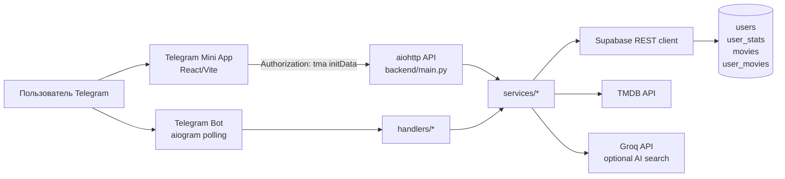

# Архитектура

## Фактическая схема

`backend/main.py` одновременно поднимает HTTP-сервер и `aiogram` polling. `config.py` создаёт глобальные экземпляры Bot, TMDBClient, MemoryCache, SupabaseDatabase и RecommendationService.

## Потоки

Mini App: `frontend/src/lib/api.ts` → Render URL → `auth_middleware` → `web_app/api.py` → сервисы → Supabase/TMDB → JSON.

TV progress flow: `TvProgressPanel` → `/api/tv/*` → `services/tv_service.py` → cached `tv_seasons`/`tv_episodes` + row-based `user_episode_progress`. Future episodes are excluded from counters and next-episode selection. Release notifications use the one-shot `backend/jobs/refresh_tv_notifications.py` job and the existing aiogram bot; deployment must schedule that script externally.

Telegram: update → middleware (`ensure_user`, throttling) → `handlers/*` → `services/*` → Supabase/TMDB → message/callback response.

Frontend uses Telegram `initDataUnsafe.user.id` for the request payload. The backend treats the signed Telegram initData identity as authoritative; there is no production fallback identity. An explicit `VITE_DEV_USER_ID` is accepted only in Vite development mode.

## Слои

- handlers — команды, callback-и и Telegram UI.
- web_app — HTTP routes, auth middleware, serialization.
- services — бизнес-логика поиска, рекомендаций, библиотеки, квиза и TMDB.
- database — Supabase access. `services/database.py` является фасадом, но часть web-кода напрямую обращается к `db._client`, что нарушает границу слоя.
- models — `MovieModel` и DTO-like dataclasses.

## Deployment facts

Backend требует `PORT`, default 10000, и слушает `0.0.0.0`. Frontend содержит Cloudflare config, но отдельного deployment manifest нет. Render configuration, Telegram webhook setup и production domains: **Unknown / requires runtime or infrastructure verification.**

The verified Supabase baseline and applied table hardening are documented in [SUPABASE_BASELINE.md](SUPABASE_BASELINE.md). Public roles no longer have table access; backend service-role access remains responsible for Telegram ownership enforcement.
